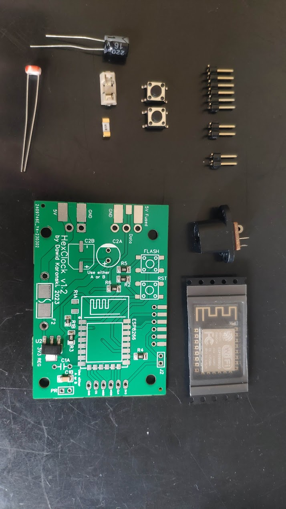

# 	&#11042;	 Hex Clock


#### Welcome to the repository made to share my awesome project with the world.

The *Hex Clock* is a hexagon-shaped LED matrix with each pixel also in the shape of a hexagon!
There are 127 individual RGB pixels ready to pour some colors on your wall.

The project is based on an awesome and popular [WLED by Aircookie](https://github.com/Aircoookie/WLED) project (software-wise). I created a usermod to adjust WLED for my weirdly shaped matrix and to display the time.

All the hardware was designed, produced and assembled by me.
## 🎉Features
- night mode - It does not make your eyes tired in the night
- auto-brightness - It detects the ambient light level and auto-adjusts its brightness.


- Multiple presets - the effects run one after another in a loop. To make it even more interesting they can run in random order 😀
- Web app to control the effects
- 🌅sunrise & sunset effects - A special effect plays
- Automatic time setting - After a boot, it takes a few seconds for the clock to know the time!
- Full control over the clock via the WLED API
## 🛠️Hardware - BOM
### 3D Printed parts
I printed all the parts with ABS. The LED strip and the PCB may get a little warm, so I was kind of hesitant to print with PLA. However I think PLA can stand such temperatures.
The front part is printed in white, all the rest in black. It looks cool. 
- HexGrid (white)
- LedBase (black)
- PcbCover (black)
- RearBase (black)
- WallHook (black)

You will find the `*.stl` files in the `/3d-model` folder.
### Electronics

- custom PCB
- ESP8266-12E/F [LINK](https://www.aliexpress.com/item/1005004265299852.html?pdp_npi=4%40dis%21USD%21US%20%241.02%21US%20%241.02%21%21%211.02%211.02%21%402103850917095823909064578eaf19%2112000037068996314%21sh%21PL%21838748658%21&spm=a2g0o.store_pc_allItems_or_groupList.new_all_items_2007585817841.1005004265299852)
- FTDI programmer + wires
- 2x tact switch 5mm
- PR photoresistor 5537 or similar (~20-50kOhm bright resistance)
- C2A THT capacitor 220uF 16V
- F2 SMD 1808 5A fuse + fuse holder
- a bunch of 90&deg; 2.54mm male "dupont" pins
- J2 jumper 2.54mm
- R1B 6.8kOhm*
- R2 10kOhm*
- R3 10kOhm*
- R4 10kOhm*
- R5 10kOhm*
- R6 10kOhm*
- C1B 100nF*
- U2 AMS1117-3.3 voltage regulator*
- 5V WS2812B 60led/meter LED strip approx 2.2m long (total 127 leds)
- Power jack 5.5/2.5mm socket
- ~2m of 18AWG wire or similar
- ~1m of 26AWG wire or similar
- Power supply 5V/5A DC 5.5/2.5mm power jack
- (if needed) Power cord extension 5.5/2.5mm power jack

*presoldered on the custom PCB


### Screws
- M2x5 x30
- M3x8 x6
- M3x5 x4
### Tools
- 3D printer
- soldering iron with a small tip
- solder
- wire stripper
## 💻Installation
You can clone the [WLED-HexClock](https://github.com/Bulduper/WLED-HexClock.git) repository forked from the original WLED **[recommended]**. It already includes all the necessary changes to the code. Note that the fork might not have the latest version of the core.
If you choose this method, go directly to the **step 9**.

If you prefer to work on the vanilla WLED follow all the steps:

1. Clone the original WLED by Aircoookie repository `git clone https://github.com/Aircoookie/WLED.git`.

2. Copy the `usermod_v2_hex_clock` folder and paste into the original `WLED/usermods` folder. 

3. To `WLED/wled00/wled.h` add `WLED_GLOBAL int8_t currentLedmap _INIT(-1);` (line 240)
```cpp
// Global Variable definitions
WLED_GLOBAL int8_t currentLedmap _INIT(-1);
WLED_GLOBAL char versionString[] _INIT(TOSTRING(WLED_VERSION));
```

4. And to `WLED/wled00/wled.cpp` add `currentLedmap = loadLedmap;` (line 177)
```cpp
  if (loadLedmap >= 0) {
    if (!strip.deserializeMap(loadLedmap) && strip.isMatrix && loadLedmap == 0) strip.setUpMatrix();
    currentLedmap = loadLedmap;
    loadLedmap = -1;
  }
```
5. To `WLED/wled00/usermods_list.cpp` add `#include "../usermods/usermod_v2_hex_clock/usermod_v2_hex_clock.h"` (line 176)
```cpp
#endif

#include "../usermods/usermod_v2_hex_clock/usermod_v2_hex_clock.h"

#if defined(WLED_USE_SD_MMC) || defined(WLED_USE_SD_SPI)
```
6. To `WLED/wled00/usermods_list.cpp` add `usermods.add(new HexClock());` (line 202)
```cpp
void registerUsermods()
{
/*
   * Add your usermod class name here
   * || || ||
   * \/ \/ \/
   */
  usermods.add(new HexClock());
  //usermods.add(new MyExampleUsermod());
```
7. To `WLED/wled00/const.h` add `#define USERMOD_ID_HEX_CLOCK             41     // Usermod Hex-Clock` (line 155)
```cpp
#define USERMOD_ID_KLIPPER               40     // Usermod Klipper percentage
#define USERMOD_ID_HEX_CLOCK             41     // Usermod Hex-Clock
//Access point behavior
```
8. Comment out line 14 in `WLED/platform.ini`
```ini
# CI binaries
;; default_envs = nodemcuv2, esp8266_2m, esp01_1m_full, esp32dev, esp32_eth # ESP32 variant builds are temporarily excluded from CI due to toolchain issues on the GitHub Actions Linux environment
;default_envs = nodemcuv2, esp8266_2m, esp01_1m_full, esp32dev, esp32_eth, lolin_s2_mini, esp32c3dev, esp32s3dev_8MB
```

And uncomment `nodemcuv2` and `d1_mini` (below line 22)
```ini
# Single binaries (uncomment your board)
; default_envs = elekstube_ips
default_envs = nodemcuv2
; default_envs = esp8266_2m
; default_envs = esp01_1m_full
; default_envs = esp07
default_envs = d1_mini
; default_envs = heltec_wifi_kit_8
```
9. Make sure that the power supply is disconnected
10. Connect the jumper
11. Connect the FTDI programmer
12. Press both RST and FLASH simultaneously, then release RST, then release FLASH buttons. This will make the board enter flash mode.
12. Upload the code to ESP8266
13. After the upload is done, disconnect the jumper and the FTDI programmer

## 1️⃣First run
0. Power up the clock
1. Connect to WLED-AP wifi using your smartphone or PC
2. Go to 4.3.2.1 (default ip address) in your browser and input your local wifi network's SSID and password.
3. Specify a friendly mDNS address e.g. http://hex-clock.local
4. Click Save & connect
5. Connect back to your local WiFi network
6. Go to the mDNS address you've specified.
7. If you see the WLED dashboard, go to `/edit` path
8. For each of the following files in the `/config` folder: `cfg.json`, `ledmap.json`, `ledmap1.json`, `presets.json` - click `Choose file and upload`