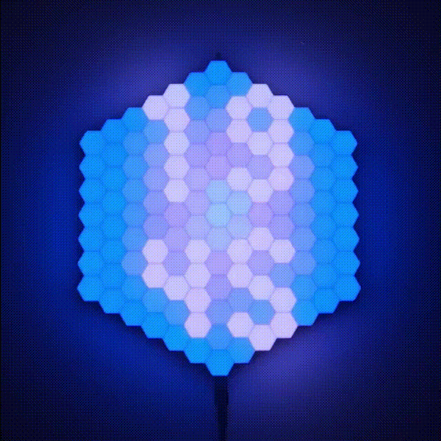
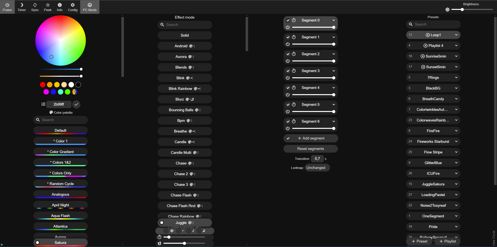
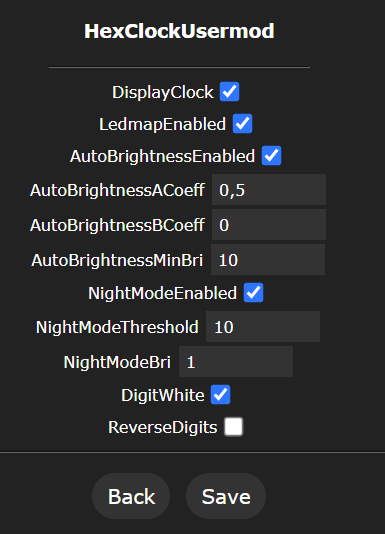
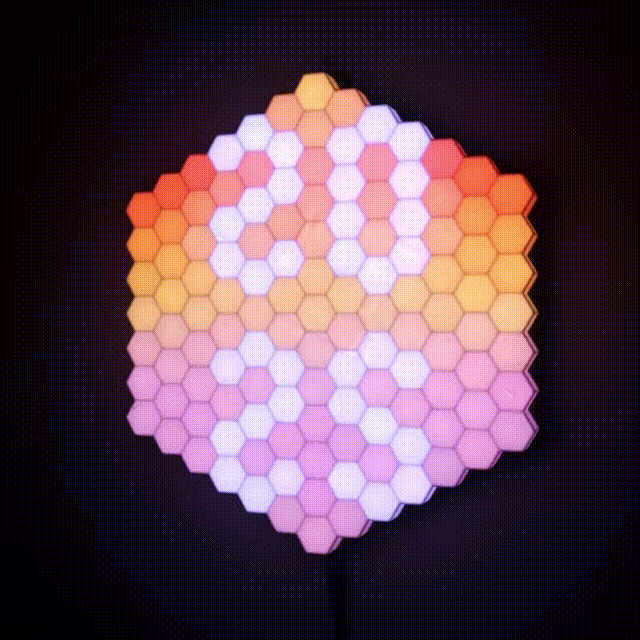
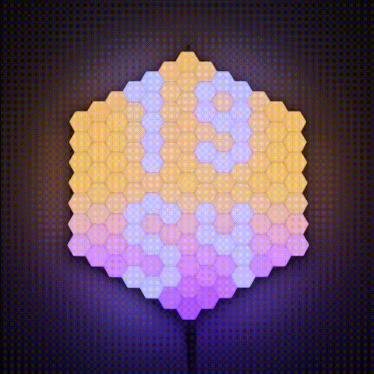

# 	&#11042;	 HexaClock
<p align="center">
  
</p>

### Welcome to the repository made to share my awesome project with the world.

The *Hexa Clock* is a hexagon-shaped LED matrix with each pixel also in the shape of a hexagon!
There are 127 individual RGB pixels ready to pour some colors on your wall.

The project is based on an awesome and popular [WLED by Aircookie](https://github.com/Aircoookie/WLED) project (software-wise). I created a usermod to adjust WLED for my weirdly shaped matrix and to display the time.

All the hardware was designed, produced and assembled by me.
## 🎉Features
- Night mode - It doesn't let your eyes get tired in the night... unless you wanna throw a 🎵🕺party🕺🎵 - then better keep the night mode off, let the 🎨 colors fill the room!
- Auto-brightness - It detects the ambient light level and auto-adjusts its brightness.


- Multiple presets - the effects run one after another in a loop. To make it even more interesting they can run in random order 😀

<p float="left">
  
  
  
  
  
and more...
</p>

- Web app to control the effects
  
  
  

- 🌅sunrise & sunset effects - A special effect plays



- Automatic time setting - After a boot, it takes a few seconds for the clock to know the time!


- Full control over the clock via the WLED API
## 🛠️Hardware - BOM
### 3D Printed parts
I printed all the parts with ABS. The LED strip and the PCB may get a little warm, so I was kind of hesitant to print with PLA. However I think PLA can stand such temperatures.
The front part is printed in white, all the rest in black. It looks cool. 
- HexGrid (white)
- LedBase (black)
- PcbCover (black)
- RearBase (black)
- WallHook (black)

You will find the `*.stl` files in the `/3d-model` folder.
### Electronics

- custom PCB
- ESP8266-12E/F [LINK](https://www.aliexpress.com/item/1005004265299852.html?pdp_npi=4%40dis%21USD%21US%20%241.02%21US%20%241.02%21%21%211.02%211.02%21%402103850917095823909064578eaf19%2112000037068996314%21sh%21PL%21838748658%21&spm=a2g0o.store_pc_allItems_or_groupList.new_all_items_2007585817841.1005004265299852) 
>*ESP32 is also supported (tested with ESP-32 devkit with WROOM-32)*
- FTDI programmer + wires
- 2x tact switch 5mm
- PR photoresistor 5537 or similar (~20-50kOhm bright resistance)
- C2A THT capacitor 220uF 16V
- F2 SMD 1808 5A fuse + fuse holder
- a bunch of 90&deg; angled 2.54mm male "dupont" pins
- J2 jumper 2.54mm
- R1B 6.8kOhm*
- R2 10kOhm*
- R3 10kOhm*
- R4 10kOhm*
- R5 10kOhm*
- R6 10kOhm*
- C1B 100nF*
- U2 AMS1117-3.3 voltage regulator*
- 5V WS2812B 60led/meter LED strip approx 2.2m long (total 127 leds)
- Power jack 5.5/2.5mm socket
- ~2m of 18AWG wire or similar
- ~1m of 26AWG wire or similar
- Power supply 5V/5A DC 5.5/2.5mm power jack
- (if needed) Power cord extension 5.5/2.5mm power jack

*presoldered on the custom PCB


### Screws
- M2x5 x30
- M3x8 x6
- M3x5 x4
### Tools
- 3D printer
- soldering iron with a small tip
- solder
- wire stripper
## 💻Installation

### Prerequisites
In order to compile and upload the code to your ESP, you will need [VS Code](https://code.visualstudio.com/Download) installed. You will also need [PlatformIO](https://platformio.org/platformio-ide), a VS Code extension for embedded C/C++ development.

### Setup and upload
You can clone the [WLED-HexClock](https://github.com/Bulduper/WLED-HexClock.git) repository forked from the original WLED **[recommended]**. It already includes all the necessary changes to the code. Note that the fork might not have the latest version of the core.
If you choose this method, go directly to the **step 10**.

If you prefer to work on the vanilla WLED follow all the steps:

1. Clone the original WLED by Aircoookie repository `git clone https://github.com/Aircoookie/WLED.git`.

2. Copy the `usermod_v2_hexa_clock` folder and paste into the original `WLED/usermods` folder. 

3. To `WLED/wled00/wled.h` add `WLED_GLOBAL int8_t currentLedmap _INIT(-1);` (around line 240)
```cpp
// Global Variable definitions
WLED_GLOBAL int8_t currentLedmap _INIT(-1);
WLED_GLOBAL char versionString[] _INIT(TOSTRING(WLED_VERSION));
```

4. And to `WLED/wled00/wled.cpp` add `currentLedmap = loadLedmap;` (around line 177)
```cpp
  if (loadLedmap >= 0) {
    if (!strip.deserializeMap(loadLedmap) && strip.isMatrix && loadLedmap == 0) strip.setUpMatrix();
    currentLedmap = loadLedmap;
    loadLedmap = -1;
  }
```
5. To `WLED/wled00/usermods_list.cpp` add `#ifdef USERMOD_HEXA_CLOCK
  #include "../usermods/usermod_v2_hexa_clock/usermod_v2_hexa_clock.h"
#endif` (around line 176)
```cpp
#endif

#ifdef USERMOD_HEXA_CLOCK
  #include "../usermods/usermod_v2_hexa_clock/usermod_v2_hexa_clock.h"
#endif

#if defined(WLED_USE_SD_MMC) || defined(WLED_USE_SD_SPI)
```
6. To `WLED/wled00/usermods_list.cpp` add `usermods.add(new HexaClock());` (around line 202)
```cpp
void registerUsermods()
{
/*
   * Add your usermod class name here
   * || || ||
   * \/ \/ \/
   */
  #ifdef USERMOD_HEXA_CLOCK
  usermods.add(new HexaClock());
  #endif
  //usermods.add(new MyExampleUsermod());
```
7. To `WLED/wled00/const.h` add `#define USERMOD_ID_HEXA_CLOCK             41     // Usermod Hexa-Clock` (around line 155)
```cpp
#define USERMOD_ID_STAIRWAY_WIPE         44     //Usermod "stairway-wipe-usermod-v2.h"
#define USERMOD_ID_HEXA_CLOCK            45     //Usermod Hexa-Clock
//Access point behavior
```
8. Comment out line 14 in `WLED/platform.ini`. **Make sure that all `default_envs` are commented out in the main platformio.ini file**.
```ini
# CI binaries
;; default_envs = nodemcuv2, esp8266_2m, esp01_1m_full, esp32dev, esp32_eth # ESP32 variant builds are temporarily excluded from CI due to toolchain issues on the GitHub Actions Linux environment
;default_envs = nodemcuv2, esp8266_2m, esp01_1m_full, esp32dev, esp32_eth, lolin_s2_mini, esp32c3dev, esp32s3dev_8MB
```
9. Copy the `usermod_v2_hexa_clock/platformio_override.ini` file into the main `WLED` folder (next to `WLED/platformio.ini`).
10. Choose your board in `platformio_override.ini`
```toml
[platformio]
# Choose depending on your board type (ESP8266 or ESP32)
default_envs = HexaClock_ESP8266
; default_envs = HexaClock_ESP32
```
11. Make sure that the power supply is disconnected
12. Connect the jumper
13. \* Connect the FTDI programmer to your PC via USB cable and to the ESP via PCB pins.
14. \* Press both RST and FLASH simultaneously, then release RST, then release FLASH buttons. This will make the board enter flash mode.
15. Upload the code to ESP
16. After the upload is done, disconnect the jumper and the FTDI programmer

\* Required for non-dev boards only

## 1️⃣First run
0. Power up the clock
1. Connect to `HexaClock-AP` wifi access point using your smartphone or PC
2. Go to `4.3.2.1` (default ip address) in your browser
3. If you see the WLED dashboard, go to `4.3.2.1/edit` 
4. For each of the following files in the `/config` folder: `cfg.json`, `ledmap.json`, `ledmap1.json`, `presets.json` - click `Choose file and upload`. At the end of the operation you should have 4 files uploaded to `/edit` path.
5. Configure your HexaClock to connect to your existing network
6. [Optional] Specify a friendly mDNS address e.g. http://hexa-clock.local
7. Click Save & connect
8. Connect back to your local WiFi network on our PC
9. Go to the mDNS address you've specified. If the mDNS address does not resolve, scan your network (e.g. using AngryIP Scanner) to discover the IP address of your HexaClock.

## 📈Improvements for the future
- Design "shape-aware" effects. Using the 2D, hexagonal matrix gives opportunities for very cool (much cooler than the current) effects.
- Design the PCB in the same shape and size as the display, so that it's also a base. All the electronics components would be placed on in (including the LEDs, power connector and light sensor). It would make the assembly much easier.
- Use ESP-32 - the modern, more powerful and more reliable board.